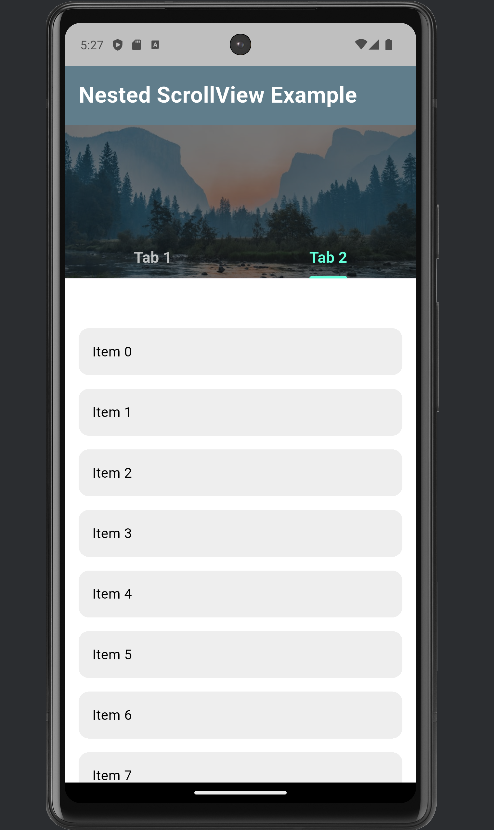

# Flutter NestedScrollView Example

NestedScrollView is a widget that gives you  control over 
how your app scrolls, especially when you have multiple scrollable areas 
like a header and a body with tabs.

I implemented a scrollable flutter UI using `NestedScrollView`, `SliverAppBar` and `TabBarView`.

1. SliverAppBar: A scrollable app bar that i used to expand and collapse.
2. TabBar: A row of clickable tabs placed under the app bar.
3. TabBarView: It displays the content for each tab using a scrollable list.

## How to run 

1. CLone the repository
2. Run the app using: 

```bash
flutter run

## Demo Screenshot

